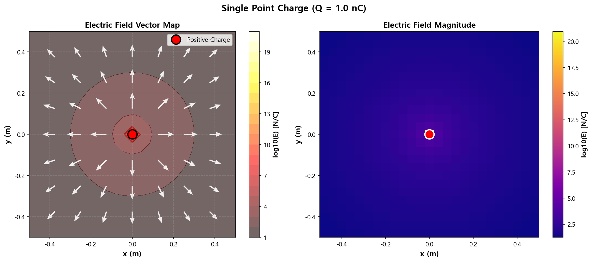
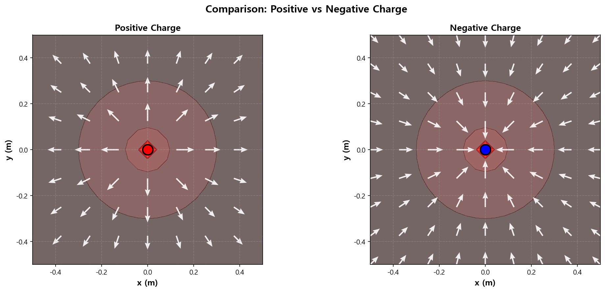

01. 전기장 기초 (Electric Field Basics)
========================================

파일: ``week10/01_electric_field_basics.py``

개요
----

단일 점전하가 만드는 전기장을 쿨롱의 법칙으로 계산하고, Quiver 플롯과 히트맵으로 시각화합니다.

물리 배경
---------

쿨롱의 법칙
^^^^^^^^^^^

두 점전하 사이의 힘:

.. math::

   F = k_e \frac{q_1 q_2}{r^2}

전기장의 정의
^^^^^^^^^^^^^

시험 전하 :math:`q` 에 작용하는 힘 당 전기장:

.. math::

   \mathbf{E} = \frac{\mathbf{F}}{q} = k_e \frac{Q}{r^2} \hat{r}

- 양전하: 전기장이 전하로부터 **밖으로** 발산
- 음전하: 전기장이 전하 쪽으로 **수렴**

시뮬레이션 파라미터
-------------------

.. list-table::
   :header-rows: 1
   :widths: 30 20 50

   * - 파라미터
     - 값
     - 설명
   * - ``Q``
     - :math:`1 \times 10^{-9}\ \mathrm{C}`
     - 전하량 (1 나노쿨롱)
   * - 격자 크기
     - 25 × 25
     - 계산 격자점 수
   * - 계산 범위
     - :math:`[-0.5, 0.5]\ \mathrm{m}`
     - x, y 범위
   * - :math:`k_e`
     - :math:`8.99 \times 10^9`
     - 쿨롱 상수 (N·m²/C²)

함수 레퍼런스
-------------

.. function:: electric_field(x, y, Q, q_pos)

   점전하가 만드는 전기장 벡터를 계산합니다.

   :param x: x 좌표 배열 (meshgrid)
   :param y: y 좌표 배열 (meshgrid)
   :param Q: 전하량 [C]
   :param q_pos: 전하의 위치 ``[x0, y0]``
   :returns: ``(Ex, Ey, E_magnitude)`` — x/y 성분과 크기

   수식:

   .. math::

      E_x = k_e \frac{Q (x - x_0)}{r^3}, \quad E_y = k_e \frac{Q (y - y_0)}{r^3}

   .. note::

      ``r = max(r, 1e-10)`` 으로 원점에서의 0 나누기를 방지합니다.

출력 파일
---------

.. list-table::
   :header-rows: 1
   :widths: 40 60

   * - 파일
     - 내용
   * - ``outputs/01_single_charge_field.png``
     - 단일 점전하의 벡터 맵 + 크기 히트맵
   * - ``outputs/01_charge_comparison.png``
     - 양전하 vs 음전하 비교

핵심 개념
---------

1. 전기장은 **벡터장** — 각 점에서 방향과 크기를 가짐
2. 전기장 크기는 거리의 제곱에 반비례 (:math:`E \propto 1/r^2`)
3. 양전하 → 전기장 발산 / 음전하 → 전기장 수렴
4. 전하에 가까울수록 전기장이 강함 (로그 스케일로 시각화)

실행 예시
---------

::

   cd week10
   python 01_electric_field_basics.py

출력 예시::

   ======================================================================
   01. Electric Field Basics - Single Point Charge
   ======================================================================
   전하량: Q = 1.0 nC
   격자 크기: 25 x 25
   계산 범위: [-0.5, 0.5] m
   전기장 계산 중...
   최대 전기장 크기: 3.60e+11 N/C
   최소 전기장 크기: 7.19e+07 N/C
   [OK] 그래프 저장: outputs/01_single_charge_field.png
   [OK] 그래프 저장: outputs/01_charge_comparison.png

실행 결과
---------

**단일 점전하 전기장** — 벡터 맵(왼쪽)과 크기 히트맵(오른쪽):

**양전하 vs 음전하 비교** — 전기장 방향이 정반대임을 확인:

