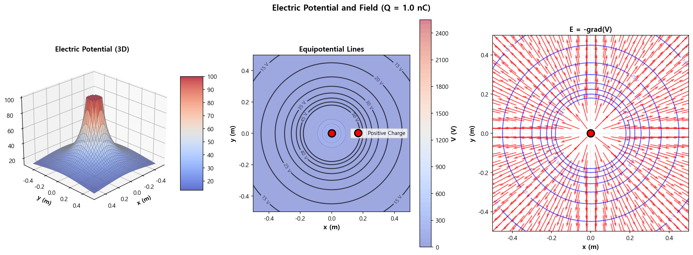
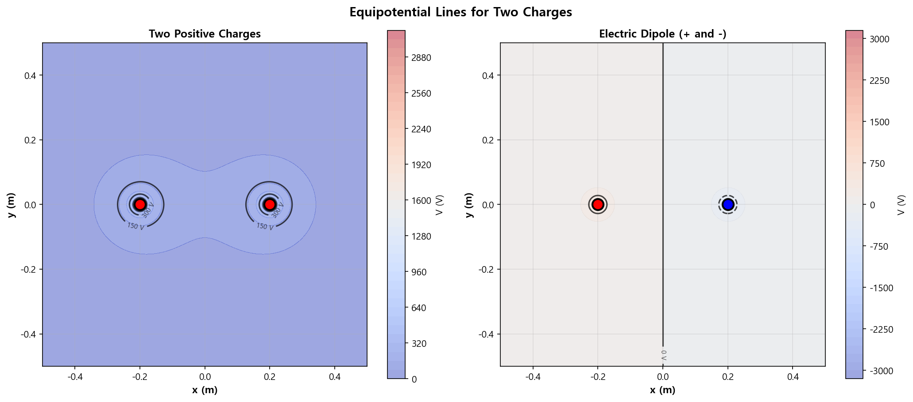

02. 전위 (Electric Potential)
==============================

파일: ``week10/02_electric_potential.py``

개요
----

점전하의 전위(스칼라장)를 계산하고 등전위선, 3D 표면, 전기장과의 관계를 시각화합니다.
두 전하 시스템(같은 부호 / 다른 부호)의 등전위선도 분석합니다.

물리 배경
---------

전위의 정의
^^^^^^^^^^^

점전하 :math:`Q` 가 만드는 전위:

.. math::

   V = k_e \frac{Q}{r}

전위는 **스칼라장** — 각 점에서 크기(부호 포함)만 존재합니다.

전기장과 전위의 관계
^^^^^^^^^^^^^^^^^^^^

.. math::

   \mathbf{E} = -\nabla V = -\left(\frac{\partial V}{\partial x}, \frac{\partial V}{\partial y}\right)

전기장은 전위의 기울기(gradient)의 음수 방향입니다.
등전위선과 전기장은 항상 **수직**\ 입니다.

시뮬레이션 파라미터
-------------------

.. list-table::
   :header-rows: 1
   :widths: 30 20 50

   * - 파라미터
     - 값
     - 설명
   * - ``Q``
     - :math:`1 \times 10^{-9}\ \mathrm{C}`
     - 전하량
   * - 격자 크기
     - 200 × 200
     - 고해상도 격자
   * - 계산 범위
     - :math:`[-0.5, 0.5]\ \mathrm{m}`
     - x, y 범위

함수 레퍼런스
-------------

.. function:: electric_potential(x, y, Q, q_pos)

   점전하의 전위를 계산합니다.

   :param x: x 좌표 배열
   :param y: y 좌표 배열
   :param Q: 전하량 [C]
   :param q_pos: 전하 위치 ``[x0, y0]``
   :returns: 전위 배열 ``V`` [V]

   .. math::

      V = k_e \frac{Q}{r}

.. function:: electric_field_from_potential(V, dx, dy)

   전위로부터 전기장을 수치 미분으로 계산합니다.

   :param V: 전위 2D 배열
   :param dx: x 방향 격자 간격 [m]
   :param dy: y 방향 격자 간격 [m]
   :returns: ``(Ex, Ey)`` — 전기장 x, y 성분

   중앙 차분법(``numpy.gradient``)을 사용합니다:

   .. math::

      E_x = -\frac{\partial V}{\partial x}, \quad E_y = -\frac{\partial V}{\partial y}

출력 파일
---------

.. list-table::
   :header-rows: 1
   :widths: 40 60

   * - 파일
     - 내용
   * - ``outputs/02_potential_contours.png``
     - 전위 3D 표면 + 등전위선 + E 벡터 (3패널)
   * - ``outputs/02_two_charges_potential.png``
     - 같은 부호 두 전하 / 쌍극자 등전위선 비교

핵심 개념
---------

1. 전위는 **스칼라장** (방향 없음, 크기만 존재)
2. **등전위선**: 전위가 같은 점들의 집합 (전기장에 수직)
3. :math:`\mathbf{E} = -\nabla V` — 전위가 급격히 변하는 곳 = 전기장이 강함
4. 전기장은 높은 전위에서 낮은 전위 방향으로 향함
5. 두 전하의 전위는 **중첩 원리**\ 로 합산: :math:`V_{total} = V_1 + V_2`

시각화 구성
-----------

``02_potential_contours.png``\ 는 3개의 패널로 구성됩니다:

- **왼쪽 (3D)**: 전위의 3D 표면 플롯 (전하 근처 피크)
- **중앙**: 등전위선 (색상 = 전위 크기)
- **오른쪽**: :math:`\mathbf{E} = -\nabla V` — 등전위선 위에 전기장 벡터

실행 결과
---------

**전위 3D 표면 + 등전위선 + 전기장 벡터** (3패널):

**두 전하 시스템 등전위선** — 같은 부호(왼쪽) vs 쌍극자(오른쪽):

