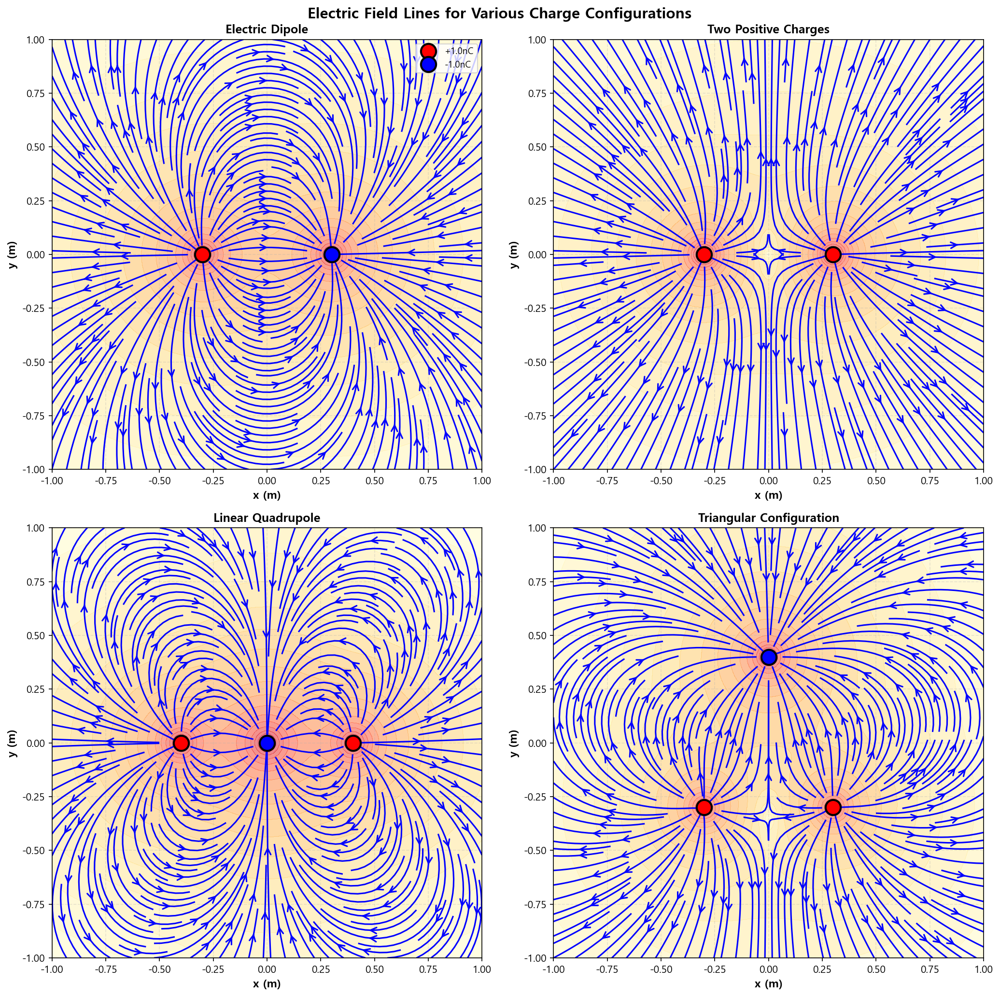
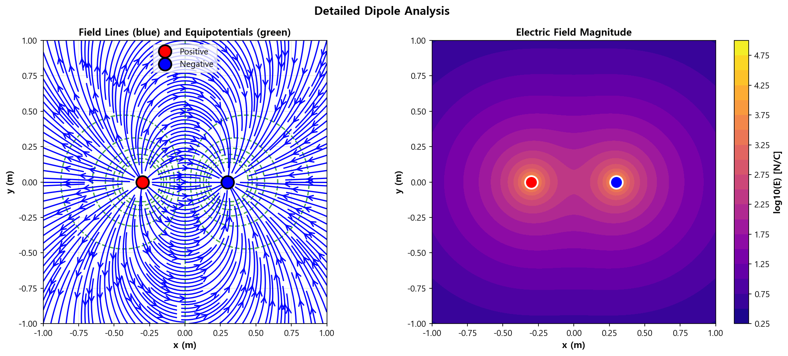

03. 전기력선 (Electric Field Lines)
=====================================

파일: ``week10/03_electric_field_lines.py``

개요
----

matplotlib의 ``streamplot`` 을 사용하여 다양한 전하 배치의 전기력선을 시각화합니다.
쌍극자, 두 양전하, 선형 사극자, 삼각 배치의 4가지 시나리오를 분석합니다.

물리 배경
---------

전기력선의 성질
^^^^^^^^^^^^^^^

1. **양전하에서 시작**, **음전하에서 끝** (또는 무한대로 발산/수렴)
2. 서로 **교차하지 않음**
3. 전기력선의 **밀도** ∝ 전기장의 세기
4. 전기력선과 등전위선은 항상 **수직**

중첩 원리
^^^^^^^^^

:math:`N` 개의 점전하에 의한 전기장:

.. math::

   \mathbf{E}_{total} = \sum_{i=1}^{N} k_e \frac{Q_i}{r_i^2} \hat{r}_i

함수 레퍼런스
-------------

.. function:: electric_field_multiple(x, y, charges, positions)

   여러 점전하의 전기장을 중첩 원리로 계산합니다.

   :param x: x 좌표 배열 (meshgrid)
   :param y: y 좌표 배열 (meshgrid)
   :param charges: 전하량 리스트 ``[Q1, Q2, ...]`` [C]
   :param positions: 전하 위치 리스트 ``[(x1,y1), (x2,y2), ...]`` [m]
   :returns: ``(Ex_total, Ey_total)``

시나리오
--------

.. list-table::
   :header-rows: 1
   :widths: 20 25 55

   * - 이름
     - 전하 구성
     - 물리적 의미
   * - **쌍극자 (Dipole)**
     - :math:`[+Q, -Q]` at :math:`(\pm 0.3, 0)`
     - 가장 간단한 비대칭 배치. 원거리에서 :math:`1/r^3` 감쇠
   * - **두 양전하**
     - :math:`[+Q, +Q]` at :math:`(\pm 0.3, 0)`
     - 중앙에 안장점(saddle point) 형성
   * - **선형 사극자**
     - :math:`[+Q, -2Q, +Q]` at :math:`(\pm 0.4, 0)`, :math:`(0,0)`
     - 사극자 모멘트, :math:`1/r^4` 원거리 감쇠
   * - **삼각 배치**
     - :math:`[+Q, +Q, -2Q]`
     - 분자 모델의 간단한 형태

출력 파일
---------

.. list-table::
   :header-rows: 1
   :widths: 40 60

   * - 파일
     - 내용
   * - ``outputs/03_field_lines.png``
     - 4가지 시나리오 전기력선 (2×2 격자)
   * - ``outputs/03_dipole_detailed.png``
     - 쌍극자 상세 분석 (전기력선 + 등전위선)

시각화 방법
-----------

``streamplot`` 함수를 사용합니다:

- ``density=2.0`` — 전기력선 밀도
- ``arrowstyle='->'`` — 방향 화살표
- 배경: 전기장 크기의 로그 스케일 색상 맵 (``YlOrRd``)

핵심 개념
---------

1. 전기력선 → 양전하에서 시작 → 음전하에서 끝
2. 전기력선 밀도 = 전기장 세기 (시각적 비교 가능)
3. 사극자는 쌍극자보다 빠르게 감쇠 (:math:`1/r^3 \to 1/r^4`)
4. 실제 분자의 전하 분포를 근사 모델링 가능

실행 결과
---------

**4가지 전하 배치의 전기력선** — 쌍극자, 두 양전하, 선형 사극자, 삼각 배치:

**쌍극자 상세 분석** — 전기력선(파란색)과 등전위선(초록색):

