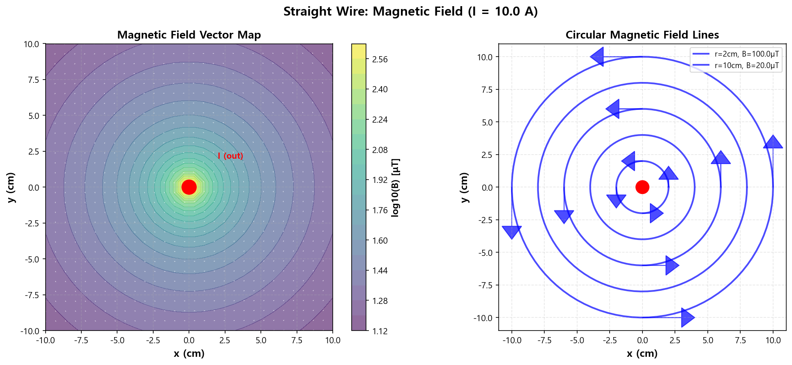
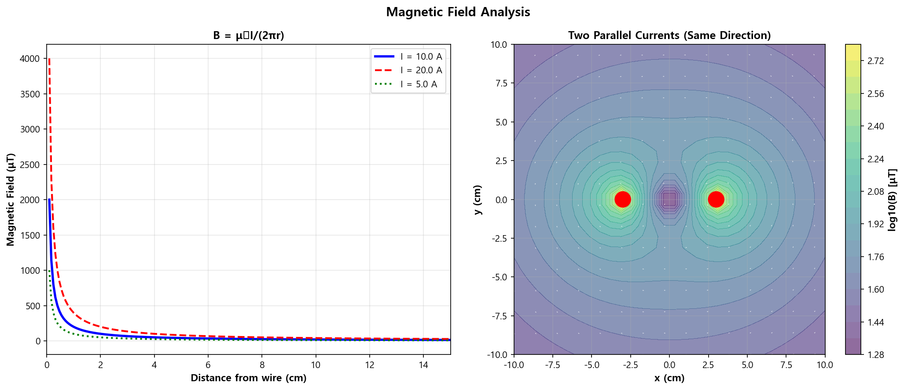

04. 자기장 기초 (Magnetic Field Basics)
========================================

파일: ``week10/04_magnetic_field_basics.py``

개요
----

무한 직선 전류가 만드는 자기장을 비오-사바르 법칙으로 계산하고,
벡터 맵과 원형 자기장선을 시각화합니다.
또한 전류 크기와 거리에 따른 자기장 세기 분석 및 두 평행 전류의 상호작용을 다룹니다.

물리 배경
---------

비오-사바르 법칙
^^^^^^^^^^^^^^^^

무한 직선 전류에 의한 자기장:

.. math::

   B = \frac{\mu_0 I}{2\pi r}

- :math:`\mu_0 = 4\pi \times 10^{-7}\ \mathrm{T \cdot m/A}`: 진공 투자율
- :math:`I`: 전류 [A]
- :math:`r`: 전선으로부터의 거리 [m]

오른손 법칙
^^^^^^^^^^^

- 엄지: 전류 방향 (z축 양의 방향)
- 나머지 손가락: 자기장 회전 방향 (반시계 방향)

자기장 벡터 성분
^^^^^^^^^^^^^^^^

전류가 원점을 통과하며 z 방향으로 흐를 때, xy 평면에서:

.. math::

   B_x = -\frac{\mu_0 I}{2\pi} \frac{y}{r^2}, \quad
   B_y = +\frac{\mu_0 I}{2\pi} \frac{x}{r^2}

시뮬레이션 파라미터
-------------------

.. list-table::
   :header-rows: 1
   :widths: 30 20 50

   * - 파라미터
     - 값
     - 설명
   * - ``I``
     - 10 A
     - 전류 크기
   * - 격자 크기
     - 30 × 30
     - 계산 격자점 수
   * - 계산 범위
     - :math:`[-0.1, 0.1]\ \mathrm{m}`
     - x, y 범위

출력 파일
---------

.. list-table::
   :header-rows: 1
   :widths: 40 60

   * - 파일
     - 내용
   * - ``outputs/04_magnetic_field.png``
     - 자기장 벡터 맵 + 원형 자기장선
   * - ``outputs/04_magnetic_analysis.png``
     - B-r 그래프 + 두 평행 전류 상호작용

핵심 개념
---------

1. 자기장은 전선 주위를 **원형**\ 으로 감쌈 (전기장과 달리 닫힌 곡선)
2. :math:`B \propto I/r` — 거리에 반비례 (전기장은 :math:`1/r^2`)
3. 오른손 법칙으로 방향 결정
4. 평행 전류: 같은 방향 → 인력 / 반대 방향 → 척력
5. 자기 단극(magnetic monopole)은 존재하지 않음: :math:`\nabla \cdot \mathbf{B} = 0`

실행 결과
---------

**자기장 벡터 맵 + 원형 자기장선**:

**B-r 그래프 + 두 평행 전류 상호작용**:

