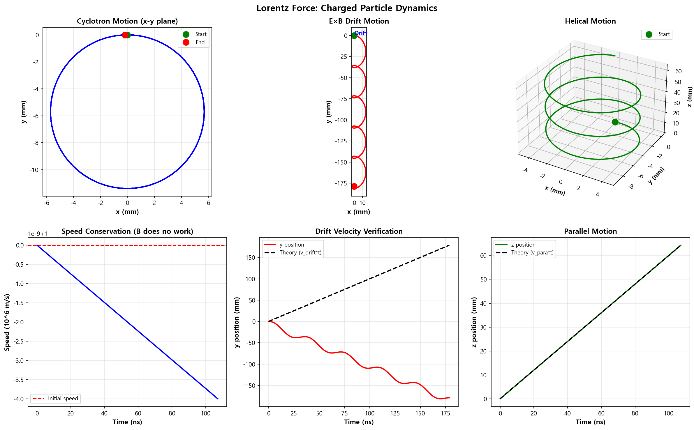

05. 로렌츠 힘 (Lorentz Force)
==============================

파일: ``week10/05_lorentz_force.py``

개요
----

로렌츠 힘으로 지배되는 하전 입자의 운동 방정식을 **Runge-Kutta 4차 방법**\ 으로 수치 적분합니다.
사이클로트론 운동, E×B 표류, 나선 운동의 3가지 시나리오를 시뮬레이션합니다.

물리 배경
---------

로렌츠 힘
^^^^^^^^^

전자기장 내 하전 입자에 작용하는 힘:

.. math::

   \mathbf{F} = q(\mathbf{E} + \mathbf{v} \times \mathbf{B})

- 전기력 :math:`q\mathbf{E}`: 입자를 가속
- 자기력 :math:`q\mathbf{v} \times \mathbf{B}`: 방향만 변경, 일(Work)을 하지 않음

사이클로트론 운동
^^^^^^^^^^^^^^^^^

균일한 자기장 :math:`\mathbf{B} = B\hat{z}` 만 있을 때, 입자는 원운동:

.. math::

   r_c = \frac{mv}{qB}, \quad \omega_c = \frac{qB}{m}

E×B 표류
^^^^^^^^^

전기장과 자기장이 교차할 때 입자는 표류(drift):

.. math::

   \mathbf{v}_{drift} = \frac{\mathbf{E} \times \mathbf{B}}{B^2}

물리 상수 (전자)
^^^^^^^^^^^^^^^^

- :math:`q = 1.6 \times 10^{-19}\ \mathrm{C}`
- :math:`m = 9.11 \times 10^{-31}\ \mathrm{kg}`

함수 레퍼런스
-------------

.. function:: rk4_step(f, y, t, dt)

   Runge-Kutta 4차 방법으로 한 스텝을 적분합니다.

   :param f: 미분 방정식 함수 ``f(y, t)``
   :param y: 현재 상태 벡터 ``[x, y, z, vx, vy, vz]``
   :param t: 현재 시간
   :param dt: 시간 스텝
   :returns: 다음 시간 스텝의 상태 벡터

   .. math::

      k_1 = f(y, t), \quad k_2 = f\!\left(y + \tfrac{dt}{2}k_1,\, t+\tfrac{dt}{2}\right)

      k_3 = f\!\left(y + \tfrac{dt}{2}k_2,\, t+\tfrac{dt}{2}\right), \quad k_4 = f(y + dt\,k_3,\, t+dt)

      y_{n+1} = y_n + \frac{dt}{6}(k_1 + 2k_2 + 2k_3 + k_4)

.. function:: lorentz_force(y, t, q, m, E_func, B_func)

   로렌츠 힘 운동 방정식. 상태 벡터의 시간 미분을 반환합니다.

   :param y: 상태 벡터 ``[x, y, z, vx, vy, vz]``
   :param t: 현재 시간
   :param q: 전하량 [C]
   :param m: 질량 [kg]
   :param E_func: 전기장 함수 ``E_func(x, y, z)`` → ``[Ex, Ey, Ez]``
   :param B_func: 자기장 함수 ``B_func(x, y, z)`` → ``[Bx, By, Bz]``
   :returns: ``[vx, vy, vz, ax, ay, az]``

시나리오
--------

.. list-table::
   :header-rows: 1
   :widths: 25 75

   * - 시나리오
     - 설명
   * - **사이클로트론**
     - :math:`\mathbf{B} = B\hat{z}`, :math:`\mathbf{E} = 0` → 원형 궤도
   * - **E×B 표류**
     - :math:`\mathbf{E} = E\hat{y}`, :math:`\mathbf{B} = B\hat{z}` → 사이클로이드 표류
   * - **나선 운동**
     - 초기 속도에 z 성분 추가 → 나선형(helix) 궤도

출력 파일
---------

- ``outputs/05_particle_trajectory.png``: 6개 서브플롯 (3 시나리오 × xy/xz 뷰)

핵심 개념
---------

1. 자기력은 속도에 수직 → 일을 하지 않음 (에너지 변화 없음)
2. 사이클로트론 반지름 :math:`r_c \propto mv/qB` — 입자 질량/속도에 비례
3. E×B 표류는 전하 부호에 무관 (전자/양이온 동일 방향)
4. RK4는 2차 Euler보다 훨씬 정확한 수치 적분 (오차 :math:`O(dt^4)`)

실행 결과
---------

**3가지 시나리오 궤도** — 사이클로트론(원운동), E×B 표류(사이클로이드), 나선 운동:

