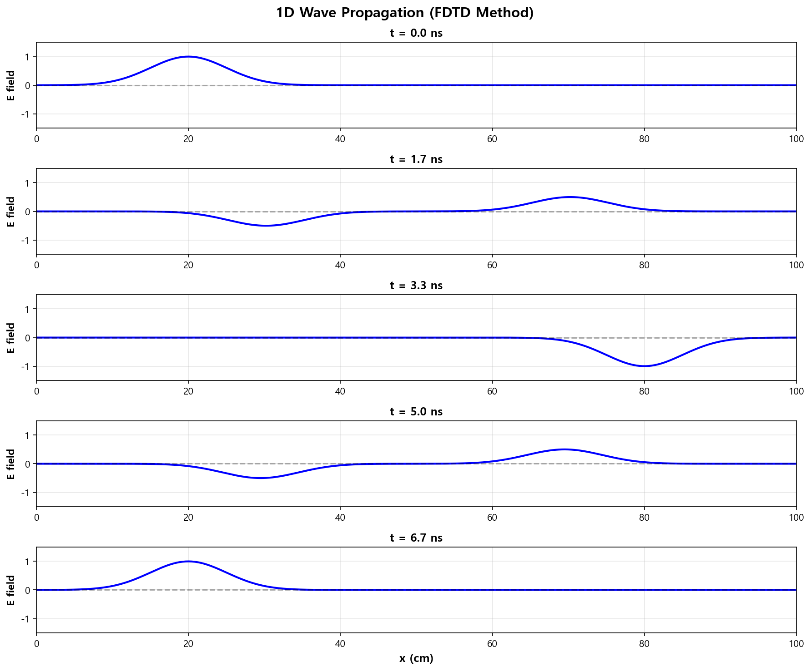
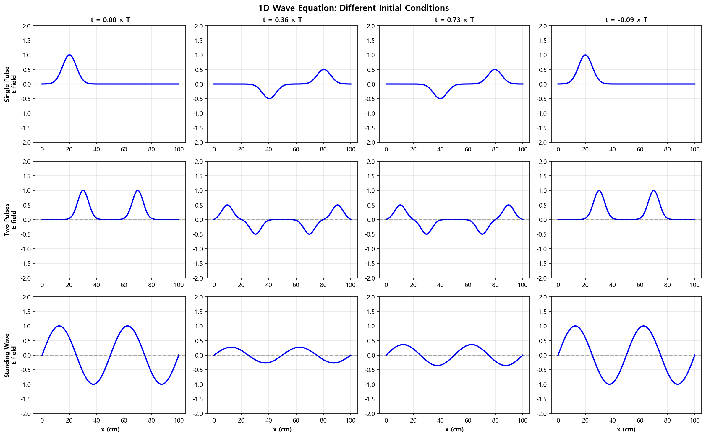

06. 1D 맥스웰 파동 방정식 (Maxwell 1D Wave Equation)
=====================================================

파일: ``week10/06_maxwell_1d.py``

개요
----

1D 전자기파 전파를 **FDTD(Finite Difference Time Domain)** 방법으로 수치 시뮬레이션합니다.
가우시안 펄스의 전파, 반사, 다양한 초기 조건을 분석합니다.

물리 배경
---------

1D 파동 방정식
^^^^^^^^^^^^^^

.. math::

   \frac{\partial^2 E}{\partial t^2} = c^2 \frac{\partial^2 E}{\partial x^2}

FDTD 이산화
^^^^^^^^^^^

중앙 차분법을 시간과 공간에 적용:

.. math::

   E_i^{n+1} = 2E_i^n - E_i^{n-1} + \left(\frac{c\,\Delta t}{\Delta x}\right)^2 \left(E_{i+1}^n - 2E_i^n + E_{i-1}^n\right)

CFL 안정성 조건
^^^^^^^^^^^^^^^

시뮬레이션이 안정하려면:

.. math::

   \frac{c\,\Delta t}{\Delta x} \leq 1

본 코드에서는 ``CFL = 0.9`` 를 사용합니다.

시뮬레이션 파라미터
-------------------

.. list-table::
   :header-rows: 1
   :widths: 30 20 50

   * - 파라미터
     - 값
     - 설명
   * - ``Lx``
     - 1.0 m
     - 공간 크기
   * - ``Nx``
     - 500
     - 공간 격자점 수
   * - ``dx``
     - 0.002 m
     - 격자 간격
   * - ``CFL``
     - 0.9
     - CFL 수 (안정성 여유)
   * - ``c``
     - :math:`3 \times 10^8\ \mathrm{m/s}`
     - 광속
   * - ``T_total``
     - :math:`2L_x/c`
     - 파동이 왕복하는 총 시간

출력 파일
---------

.. list-table::
   :header-rows: 1
   :widths: 40 60

   * - 파일
     - 내용
   * - ``outputs/06_wave_1d_snapshots.png``
     - 5개 시간 스냅샷 (전파 과정)
   * - ``outputs/06_wave_1d_scenarios.png``
     - 3가지 초기 조건 × 4 시간 스텝

경계 조건
---------

반사 경계 (Reflecting boundary): 양 끝에서 파동이 반사됩니다.

.. math::

   E_0 = 0, \quad E_{N-1} = 0

핵심 개념
---------

1. **FDTD**: 시간-공간을 격자로 이산화하여 파동을 단계별로 계산
2. **CFL 조건**: :math:`c\,\Delta t / \Delta x \leq 1` 위반 시 수치 불안정 발생
3. 가우시안 펄스는 진행하면서 양 끝에서 반사
4. 파동 속도는 항상 :math:`c` 로 보존 (분산 없음, 이상적 매질)

주의 사항
---------

.. warning::

   CFL 조건을 위반하면 수치 오류가 지수적으로 증폭됩니다.
   ``CFL > 1`` 로 설정하면 시뮬레이션이 발산합니다.

실행 결과
---------

**5개 시간 스냅샷** — 가우시안 펄스의 전파·반사 과정:

**3가지 초기 조건 × 4 시간 스텝** 비교:

