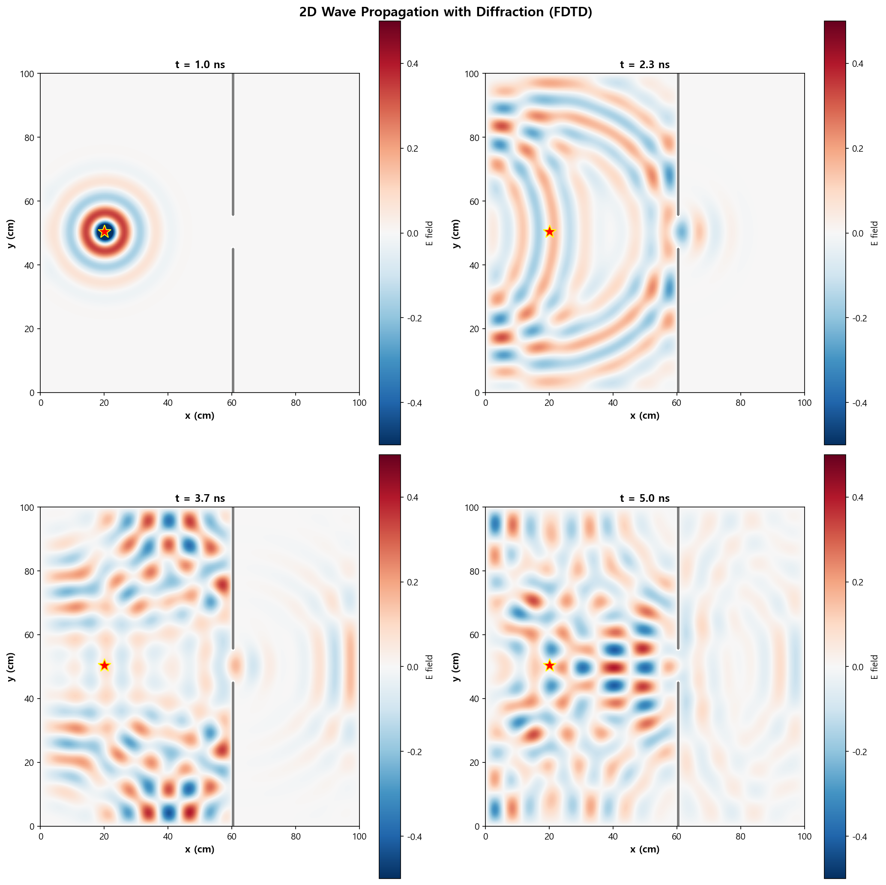
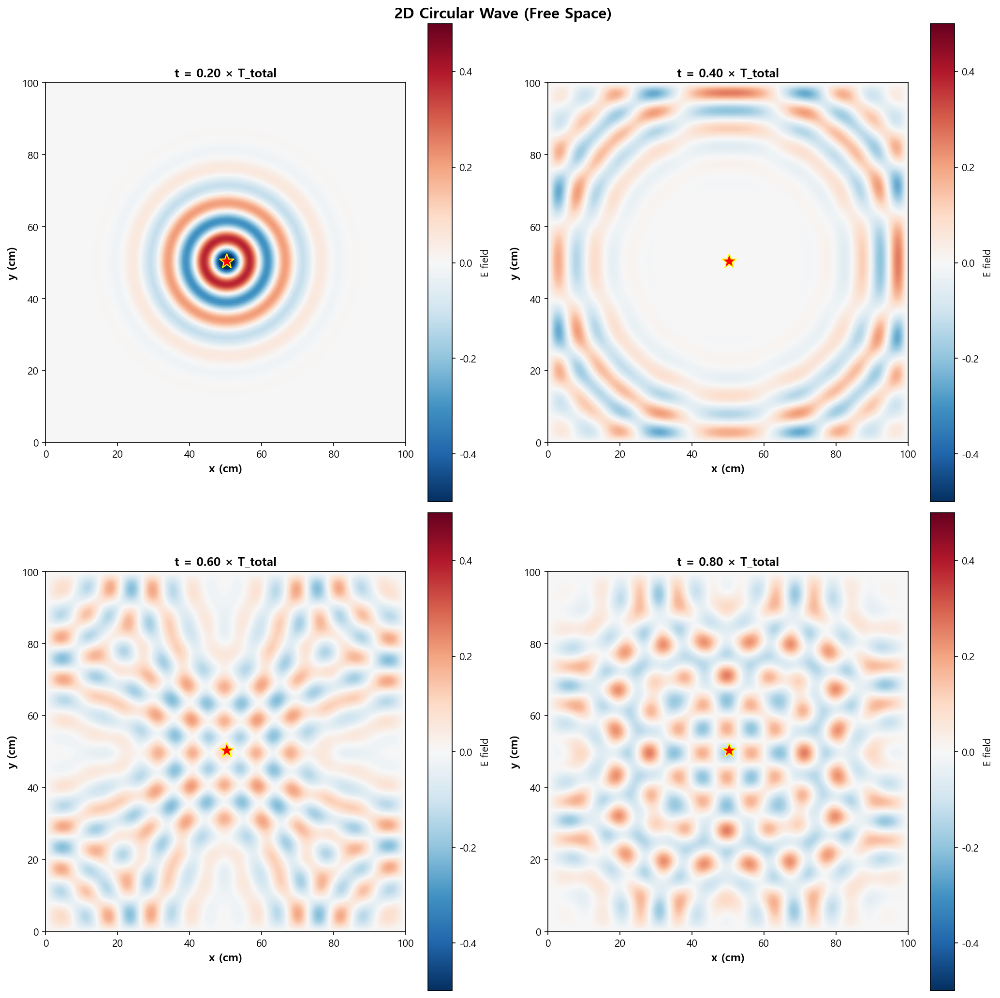

07. 2D 맥스웰 파동 방정식 (Maxwell 2D Wave Equation)
=====================================================

파일: ``week10/07_maxwell_2d.py``

개요
----

2D 전자기파 전파를 FDTD 방법으로 시뮬레이션합니다.
점 소스에서 발생하는 원형 파면, 슬릿 회절, 장애물 산란을 분석합니다.

물리 배경
---------

2D 파동 방정식
^^^^^^^^^^^^^^

.. math::

   \frac{\partial^2 E}{\partial t^2} = c^2 \left(\frac{\partial^2 E}{\partial x^2} + \frac{\partial^2 E}{\partial y^2}\right)

2D FDTD 이산화
^^^^^^^^^^^^^^

.. math::

   E_{i,j}^{n+1} = 2E_{i,j}^n - E_{i,j}^{n-1}
   + r_x^2(E_{i+1,j}^n - 2E_{i,j}^n + E_{i-1,j}^n)
   + r_y^2(E_{i,j+1}^n - 2E_{i,j}^n + E_{i,j-1}^n)

여기서 :math:`r_x = c\Delta t/\Delta x`, :math:`r_y = c\Delta t/\Delta y`.

2D CFL 안정성 조건
^^^^^^^^^^^^^^^^^^

2D에서는 더 엄격한 조건:

.. math::

   c\,\Delta t \sqrt{\frac{1}{\Delta x^2} + \frac{1}{\Delta y^2}} \leq 1

본 코드는 ``CFL = 0.7`` 로 여유를 둡니다.

시뮬레이션 파라미터
-------------------

.. list-table::
   :header-rows: 1
   :widths: 30 20 50

   * - 파라미터
     - 값
     - 설명
   * - 영역 크기
     - 1.0 × 1.0 m
     - :math:`L_x \times L_y`
   * - 격자점
     - 150 × 150
     - :math:`N_x \times N_y`
   * - ``CFL``
     - 0.7
     - 2D CFL 수
   * - ``c``
     - :math:`3 \times 10^8\ \mathrm{m/s}`
     - 광속

시나리오
--------

.. list-table::
   :header-rows: 1
   :widths: 25 75

   * - 시나리오
     - 설명
   * - **자유 공간 전파**
     - 중앙 점 소스 → 원형 파면이 사방으로 전파
   * - **슬릿 회절**
     - 왼쪽 벽에 좁은 슬릿 → 회절 패턴 형성
   * - **장애물 산란**
     - 직사각형 장애물 → 산란 및 그림자 영역

출력 파일
---------

.. list-table::
   :header-rows: 1
   :widths: 40 60

   * - 파일
     - 내용
   * - ``outputs/07_wave_2d_snapshots.png``
     - 슬릿 회절 4 시간 스냅샷
   * - ``outputs/07_wave_2d_circular.png``
     - 자유 공간 원형 파면 전파

핵심 개념
---------

1. 2D 파동은 점 소스에서 **원형 파면**\ 으로 전파
2. **회절**: 슬릿 통과 후 파동이 구부러짐 (슬릿 폭 ≈ 파장일 때 뚜렷)
3. **간섭**: 두 슬릿을 통과하면 보강/상쇄 간섭 무늬 형성
4. 2D CFL 조건은 1D보다 엄격 (:math:`1/\sqrt{2}` 배 더 작게)

.. note::

   2D 시뮬레이션은 메모리와 계산 시간이 1D 대비 :math:`N` 배 더 필요합니다.
   ``Nx = Ny = 150`` 에서 수 초가 소요될 수 있습니다.

실행 결과
---------

**슬릿 회절 4 시간 스냅샷** — 파동이 슬릿을 통과하며 회절 패턴을 형성하는 과정:

**자유 공간 원형 파면 전파** — 점 소스에서 동심원으로 확산:

