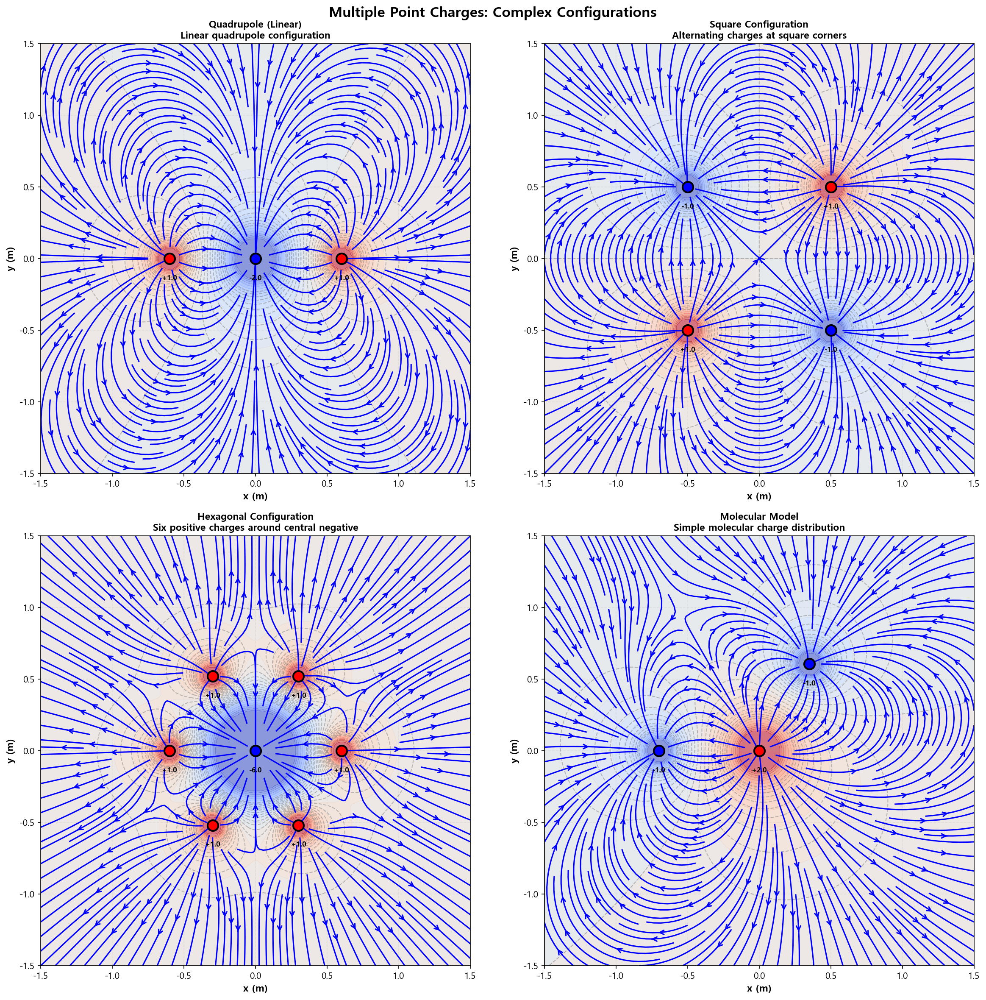
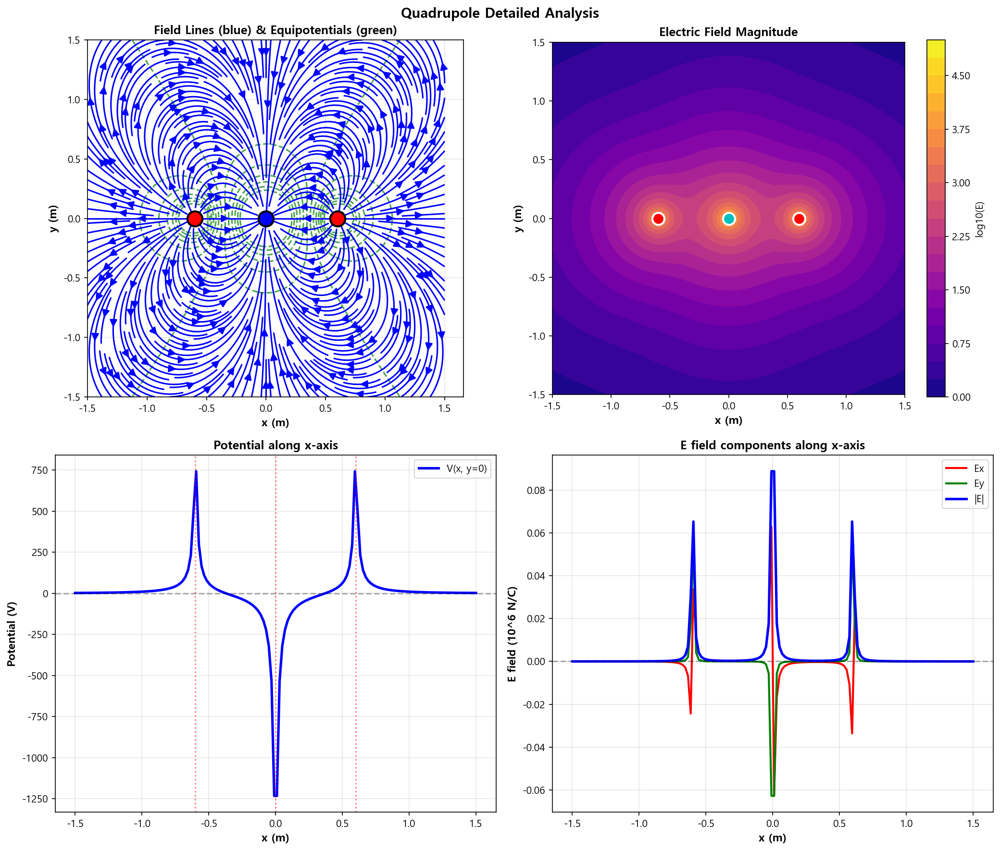

08. 다중 점전하 (Multiple Point Charges)
=========================================

파일: ``week10/08_multiple_charges.py``

개요
----

복잡한 전하 배치(선형 사극자, 정사각형, 정육각형, 분자 모델)에서 중첩 원리를 적용하여
전기장과 전위를 계산하고, 다중극 전개(multipole expansion)를 분석합니다.

물리 배경
---------

중첩 원리
^^^^^^^^^

N개의 점전하에 의한 전체 전기장과 전위:

.. math::

   \mathbf{E}_{total} = \sum_{i=1}^{N} \mathbf{E}_i, \quad
   V_{total} = \sum_{i=1}^{N} V_i = \sum_{i=1}^{N} k_e \frac{Q_i}{r_i}

다중극 전개
^^^^^^^^^^^

원거리에서의 전위는 다중극으로 전개됩니다:

.. math::

   V \approx \frac{k_e q_{total}}{r} + \frac{k_e \mathbf{p} \cdot \hat{r}}{r^2}
   + \frac{k_e Q_{quad}}{r^3} + \cdots

- **독점(monopole)**: 전체 전하가 0이 아닌 경우 (:math:`1/r` 감쇠)
- **쌍극자(dipole)**: 총 전하 = 0, 쌍극자 모멘트 ≠ 0 (:math:`1/r^2` 감쇠)
- **사극자(quadrupole)**: 쌍극자 모멘트 = 0 (:math:`1/r^3` 감쇠)

함수 레퍼런스
-------------

.. function:: electric_field_multiple(x, y, charges, positions)
   :no-index:

   여러 점전하의 전기장을 중첩 원리로 계산합니다.

   :param x: x 좌표 배열 (meshgrid)
   :param y: y 좌표 배열 (meshgrid)
   :param charges: 전하량 리스트
   :param positions: 전하 위치 리스트
   :returns: ``(Ex_total, Ey_total)``

.. function:: electric_potential_multiple(x, y, charges, positions)

   여러 점전하의 전위를 중첩 원리로 계산합니다.

   :param x: x 좌표 배열
   :param y: y 좌표 배열
   :param charges: 전하량 리스트
   :param positions: 전하 위치 리스트
   :returns: 전위 배열 ``V_total`` [V]

전하 배치 시나리오
------------------

.. list-table::
   :header-rows: 1
   :widths: 25 35 40

   * - 이름
     - 구성
     - 원거리 감쇠
   * - **선형 사극자**
     - :math:`[+Q, -2Q, +Q]` 선형 배치
     - :math:`1/r^3`
   * - **정사각형**
     - :math:`[+Q, -Q, +Q, -Q]` 정사각형 꼭짓점
     - :math:`1/r^3` 이상
   * - **정육각형**
     - 6개 양전하 + 중앙 음전하
     - 대칭 패턴
   * - **분자 모델**
     - 비대칭 다원자 배치
     - 쌍극자 우세

출력 파일
---------

.. list-table::
   :header-rows: 1
   :widths: 40 60

   * - 파일
     - 내용
   * - ``outputs/08_multiple_charges.png``
     - 4가지 배치의 전기력선 + 등전위선
   * - ``outputs/08_quadrupole_analysis.png``
     - 선형 사극자 상세 분석 + x축 프로파일

핵심 개념
---------

1. 중첩 원리: 전기장/전위는 개별 성분의 벡터/스칼라 합
2. 총 전하가 0이면 원거리 전위가 빠르게 감쇠 (쌍극자 → 사극자 순)
3. 사극자 필드는 쌍극자보다 더 빠르게 감쇠 (:math:`1/r^3 \to 1/r^4`)
4. 실제 분자의 전하 분포를 수치적으로 모델링 가능

실행 결과
---------

**4가지 전하 배치** — 선형 사극자, 정사각형, 정육각형, 분자 모델:

**선형 사극자 상세 분석** — 전위 분포와 x축 프로파일:

