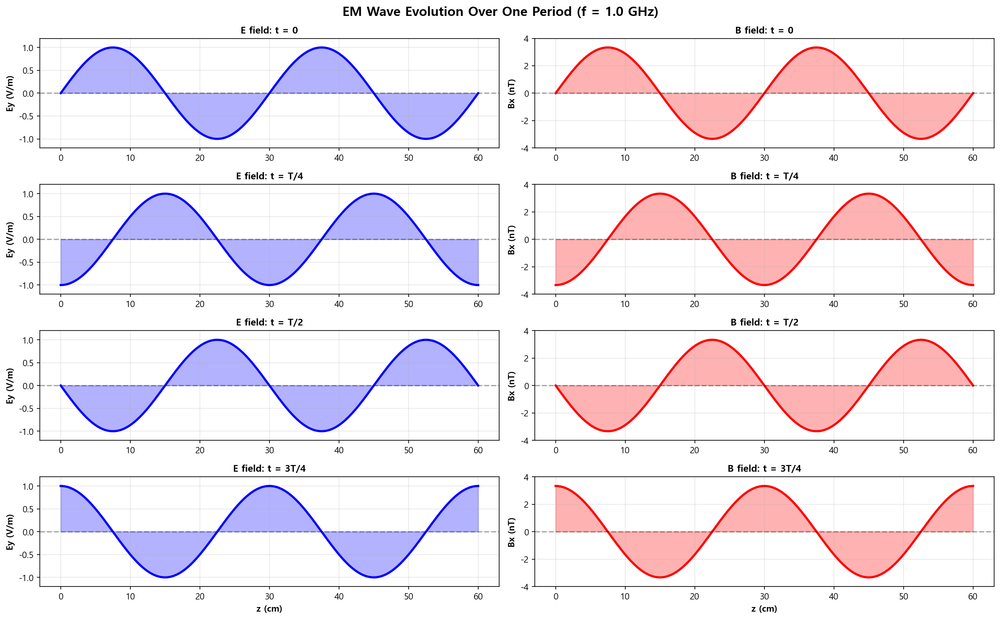
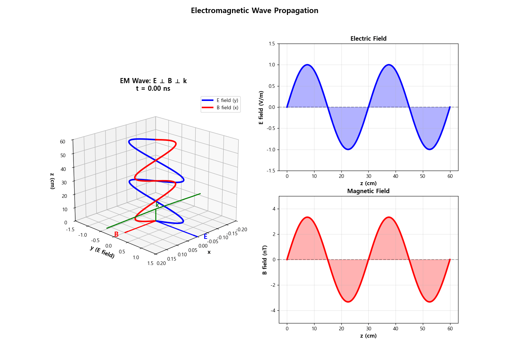

09. 전자기파 애니메이션 (EM Wave Animation)
============================================

파일: ``week10/09_em_wave_animation.py``

개요
----

맥스웰 방정식의 평면파 해를 3D로 시각화하고 60프레임 GIF 애니메이션으로 저장합니다.
E장과 B장의 위상 관계, 포인팅 벡터 방향을 보여줍니다.

물리 배경
---------

평면파 해
^^^^^^^^^

z 방향으로 전파하는 평면 전자기파:

.. math::

   \mathbf{E}(z, t) = E_0 \sin(kz - \omega t)\,\hat{y}

.. math::

   \mathbf{B}(z, t) = B_0 \sin(kz - \omega t)\,\hat{x}

- :math:`k = 2\pi/\lambda`: 파수
- :math:`\omega = 2\pi f`: 각진동수
- :math:`E_0 / B_0 = c`

E와 B의 관계
^^^^^^^^^^^^

.. math::

   \frac{E_0}{B_0} = c = \frac{1}{\sqrt{\mu_0 \varepsilon_0}}

포인팅 벡터
^^^^^^^^^^^

전자기파의 에너지 전파 방향과 세기:

.. math::

   \mathbf{S} = \frac{1}{\mu_0}(\mathbf{E} \times \mathbf{B})

파동 파라미터
-------------

.. list-table::
   :header-rows: 1
   :widths: 30 25 45

   * - 파라미터
     - 값
     - 설명
   * - ``freq``
     - 1 GHz
     - 주파수
   * - ``wavelength``
     - 30 cm
     - 파장 :math:`\lambda = c/f`
   * - ``k``
     - :math:`\approx 20.9\ \mathrm{rad/m}`
     - 파수
   * - ``omega``
     - :math:`\approx 6.28 \times 10^9\ \mathrm{rad/s}`
     - 각진동수
   * - 애니메이션 프레임
     - 60
     - 1 주기 동안

출력 파일
---------

.. list-table::
   :header-rows: 1
   :widths: 40 60

   * - 파일
     - 내용
   * - ``outputs/09_em_wave.gif``
     - 3D 전자기파 애니메이션 (60프레임)
   * - ``outputs/09_wave_summary.png``
     - t = 0, T/4, T/2, 3T/4 스냅샷 4컷

3D 시각화 구성
--------------

- **파란색 화살표**: E장 (y 방향)
- **빨간색 화살표**: B장 (x 방향)
- **화살표 밀도**: 파동의 진폭에 비례
- 전파 방향: z 축

핵심 개념
---------

1. :math:`\mathbf{E} \perp \mathbf{B} \perp \hat{k}` — 세 벡터가 서로 수직
2. E와 B는 **동위상** (같이 0에서 시작하고 같이 최대)
3. 에너지는 포인팅 벡터 방향(:math:`\hat{z}`)으로 전파
4. :math:`c = 1/\sqrt{\mu_0\varepsilon_0}` — 광속은 두 상수에서 도출됨

.. note::

   GIF 생성을 위해 ``matplotlib.animation.PillowWriter`` 를 사용합니다.
   Pillow 패키지가 설치되어 있어야 합니다:

   .. code-block:: bash

      pip install Pillow

실행 결과
---------

**t = 0, T/4, T/2, 3T/4 스냅샷** — E장(파란색)과 B장(빨간색)이 동위상으로 진행:

**애니메이션 (GIF)** — 60프레임, 1 주기 동안의 전파:

