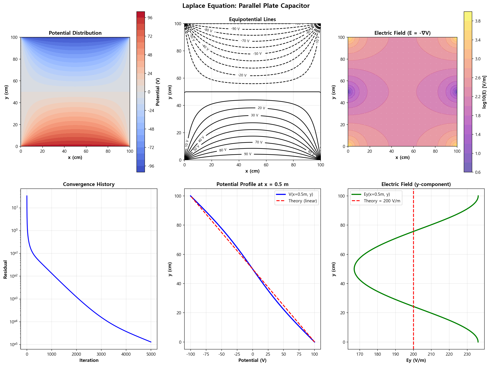
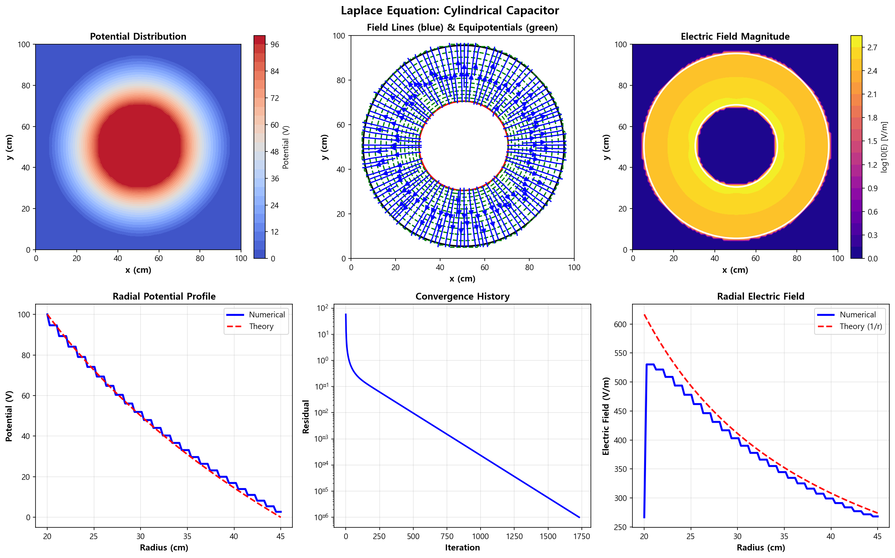

10. 도체 전위 분포 (Conductor Potential Distribution)
======================================================

파일: ``week10/10_conductor_potential.py``

개요
----

전하가 없는 영역에서의 전위 분포를 **라플라스 방정식**\ 의 수치 해법으로 계산합니다.
Gauss-Seidel 반복법을 사용하여 평행 평판 캐패시터와 원통형 캐패시터를 시뮬레이션합니다.

물리 배경
---------

라플라스 방정식
^^^^^^^^^^^^^^^

전하가 없는 영역 (:math:`\rho = 0`) 에서 전위는:

.. math::

   \nabla^2 V = \frac{\partial^2 V}{\partial x^2} + \frac{\partial^2 V}{\partial y^2} = 0

5점 스텐실 이산화
^^^^^^^^^^^^^^^^^

.. math::

   V_{i,j} = \frac{V_{i+1,j} + V_{i-1,j} + V_{i,j+1} + V_{i,j-1}}{4}

Gauss-Seidel 반복법
^^^^^^^^^^^^^^^^^^^

각 격자점을 순서대로 업데이트하고, 수렴 기준 ``tol`` 이하가 될 때까지 반복:

.. math::

   V_{i,j}^{new} = \frac{1}{4}\left(V_{i+1,j} + V_{i-1,j} + V_{i,j+1} + V_{i,j-1}\right)

- Jacobi 반복법보다 약 2배 빠르게 수렴
- 경계 조건(Dirichlet)은 고정값으로 유지

시뮬레이션 파라미터
-------------------

.. list-table::
   :header-rows: 1
   :widths: 30 20 50

   * - 파라미터
     - 값
     - 설명
   * - 영역 크기
     - 1.0 × 1.0 m
     - :math:`L_x \times L_y`
   * - 격자점
     - 100 × 100
     - :math:`N_x \times N_y`
   * - ``max_iter``
     - 10,000
     - 최대 반복 횟수
   * - ``tol``
     - :math:`10^{-6}`
     - 수렴 기준

함수 레퍼런스
-------------

.. function:: solve_laplace_gauss_seidel(V_initial, boundary, max_iter, tol)

   Gauss-Seidel 반복법으로 라플라스 방정식을 풉니다.

   :param V_initial: 초기 전위 배열 (2D)
   :param boundary: 경계 조건 마스크 (True인 곳 고정)
   :param max_iter: 최대 반복 횟수
   :param tol: 수렴 허용 오차
   :returns: ``(V_solution, convergence_history)``

시나리오
--------

**평행 평판 캐패시터**

- 위 판: :math:`V = +100\ \mathrm{V}`
- 아래 판: :math:`V = -100\ \mathrm{V}`
- 이론 해: 두 판 사이에서 균일한 전기장

**원통형 캐패시터**

- 내부 원통: :math:`V = +100\ \mathrm{V}`
- 외부 원통: :math:`V = 0\ \mathrm{V}`
- 이론 해: :math:`V(r) \propto \ln(r)` (로그 함수)

출력 파일
---------

.. list-table::
   :header-rows: 1
   :widths: 40 60

   * - 파일
     - 내용
   * - ``outputs/10_conductor_potential.png``
     - 6개 서브플롯: 전위, 등전위선, 전기장, 수렴, 프로파일
   * - ``outputs/10_cylindrical_capacitor.png``
     - 원통형 캐패시터 분석 (이론 vs 수치 비교)

수렴 특성
---------

수렴 속도는 격자 크기와 경계 조건에 따라 달라집니다:

- 100×100 격자: 약 1,000~5,000회 반복에서 수렴
- 수렴 기록(``convergence_history``)으로 반복 횟수 확인 가능

핵심 개념
---------

1. **라플라스 방정식**: 전하가 없는 영역의 전위는 주변 평균값과 같음
2. **Gauss-Seidel**: 업데이트 즉시 새 값을 사용 (Jacobi보다 빠른 수렴)
3. **Dirichlet 경계**: 경계에서 전위 고정 = 도체의 등전위 표면
4. 수치 해는 격자가 촘촘할수록 이론 해에 수렴

.. tip::

   수렴 속도를 높이려면 **SOR(Successive Over-Relaxation)** 를 사용하세요:

   .. math::

      V_{i,j}^{new} = (1-\omega)V_{i,j}^{old} + \frac{\omega}{4}(V_{i+1,j} + V_{i-1,j} + V_{i,j+1} + V_{i,j-1})

   최적 :math:`\omega \approx 1.5 \sim 1.9` 일 때 Gauss-Seidel 대비 수 배 가속.

실행 결과
---------

**평행 평판 캐패시터** — 전위 분포, 등전위선, 전기장, 수렴 곡선, 프로파일 (6 서브플롯):

**원통형 캐패시터** — 수치 해와 이론 해 비교:

